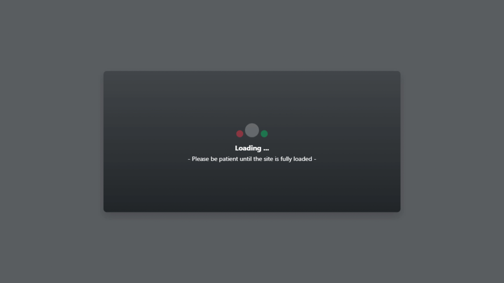
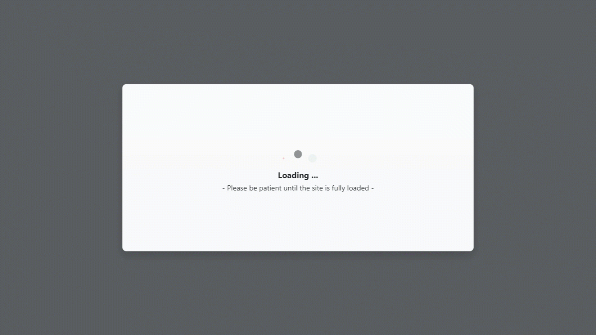

<p align="center">
<a href="https://dabram.ir/resume" target="_blank"></a>
<br>
<b>Daniel Barteh</b>
<br>
- Programmer, designer, composer and editor -
<br>
<a href="https://dabram.ir/resume">Full Resume</a>
&nbsp;&nbsp;
<a href="https://github.com/DanielBarteh">GitHub</a>
&nbsp;&nbsp;
<a href="https://linkedin.com/in/DanielBarteh">LinkedIn</a>
</p>
<hr>


**Version 2.0.0.0 is Available :**
* Dark Mode + Light Mode

DarkMode (Live Demo):

Light Mode (Live Demo):



## About This Project (Loading-Bootstrap5)
* This project made with Boostrap5 and Jquery.
* Bootstrap5 is in node_modules folders.
* Jquery is in node_modules folders.

## Extra Help
**You can enter your codes in the section:**
```
    <!--Info-->
        <section>
            -CODING HERE-
        </section>
    <!--End Info-->
```
**Spinners have animation delay. If you don't like delay, disable or delete them (line 8 to 15):**
```
        <style>
            .animation1{
                animation-delay: 0.1s !important;
            }
            .animation2{
                animation-delay: 0.2s !important;
            }
        </style>
```
**If you want this that loading fade out after load the page, uncomment line 45 to 50 or use the following command:**
```
        <script src="node_modules/jquery/dist/jquery.min.js"></script>
        <script>
          $(document).ready(function () {
            $("#Loading").fadeOut();
          });
        </script>
```